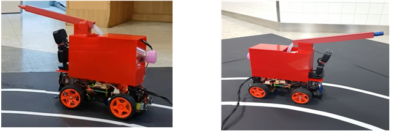
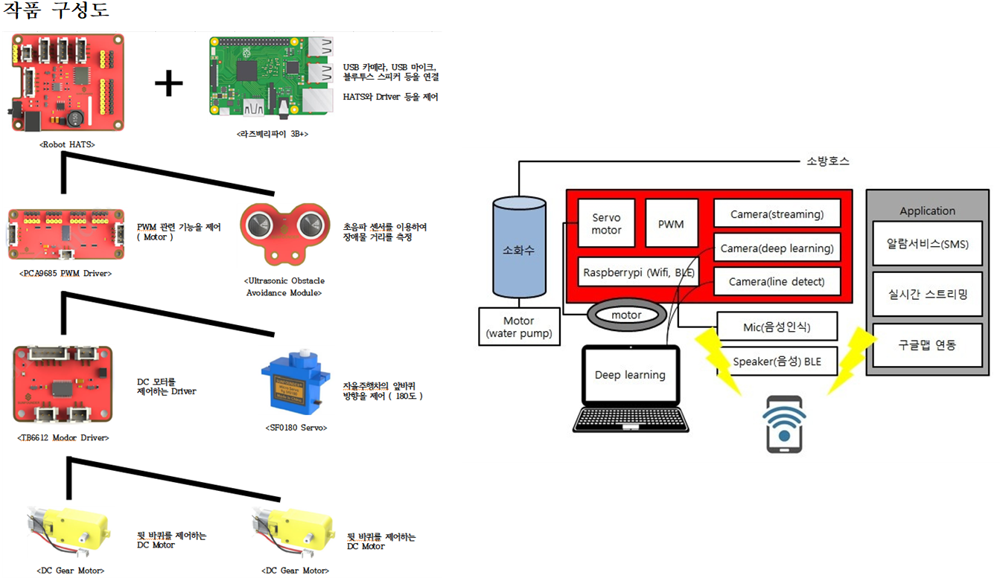
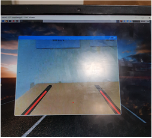
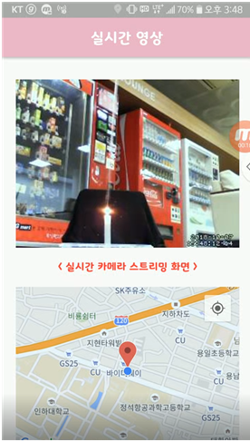
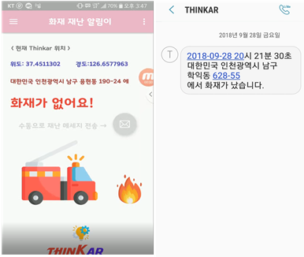

# 라즈베리파이와 딥러닝을 이용한 자율주행 소방차 (2018.04. ~ 2018.11.)  
* [동영상 링크](https://www.youtube.com/watch?v=jL21FWIVxNI&t=8s "유튜브")  

* ICT 공모전에 참가하여 수상한 경험이 있습니다. 최근 화재로 인한 인명피해가 증가하고 있으며, 가장 본질적인 문제로 ‘소방인력의 부재’가 꼽히고 있습니다. 특히 농어촌 지역은 관할 구역이 방대하지만 소방인력도 부족합니다. 이러한 문제점을 해결하고자 딥 러닝과 OpenCV를 통해무인 자율주행 기술을 구현하고, 한발 더 나아가 화재 현장에서의 초기 화재 진압도 할 수 있는 만능 무인 소방차를 제작하는 것을 목표로 제작하기 시작했습니다. 또한, Application과의 연동을 통해 Application 사용자들에게 재난 알림문자를 전송할 수 있고, 화재 현장의 실시간 스트리밍 서비스와 길 찾기 기능도 지원하게 하여 소방인력의 부족문제를 해결하고자 하였습니다.  
* 라즈베리파이의 GPIO(general-purpose input/output), PWM Driver, Motor Driver 모듈 등을 통해 차량 바퀴 역할을 하는 DC 모터 및 Servo 모터, 소화수 발사를 담당하는 워터펌프 모터, 차량 앞 장애물과의 거리를 측정하는 초음파 센서, 차량 위치를 파악할 수 있는 GPS 센서를 연결하고 이러한 모듈들을 제어하기 위해 Python 언어를 통해 코드를 작성하였습니다. 추가로 라즈베리파이에 마이크와 스피커를 연결하여 "출발", "멈춰" 등의 음성으로 차량을 제어할 수 있게 설계하였습니다.  
* 차량이 주행할 도로는 실제 도로와 유사하게 한 개의 라인이 아닌 두 개의 라인으로 제작하였습니다. 자율주행 차가 두 개의 라인으로 구성된차선을 인식할 수 있게 웹캠을 사용하였고, OpenCV 영상처리 기술을 통해 차선 인식을 구현하였습니다. 차선 인식의 정확도를 높이기 위해서차량 전방 시야에 담긴 영상의 RGB 값을 조정하여 차선 색과 유사한 색깔을 추출하였습니다. 그리고 Blur Filter, Canny Algorithm, Hough 변환을 통해 정확한 대표 좌측 선과 우측 선을 얻은 후 각각의 직선의 방정식을 계산한 뒤 두 직선의 교점을 기준으로 차량 이동 방향을 결정하였습니다.  
* 화재, 보행자, 표지판, 신호등 등을 카메라를 통해 인식하기 위해 딥 러닝 기반 Fast 객체 탐색 기법인 YOLO Algorithm을 사용했습니다. YOLO는 기존 R-CNN 계열보다 성능이 좋고 매우 빠른 속도를 갖는 모델이었기 때문에 시간성이 중요한 자율주행에 적합한 모델이라 사용하게 되었습니다. 적절한 Batch Size와 Subdivision Size를 찾아 이미지 데이터를 수 백 장 학습을 시켰고, 그 결과 실제 주행에서 97.2%의 높은 인식 정확도를 보였습니다.  
* 차량 이동 방향 앞에 장애물이 급작스럽게 출현할 시 급정거를 하기 위해 초음파 센서 모듈을 사용했습니다. 초음파 센서 모듈을 통해 차량 앞장애물과의 거리를 실시간으로 측정하고 장애물 사이의 거리가 20cm 미만일 시 차량의 모터 동작을 멈추도록 코드를 구성했습니다. 또한,GPS 모듈을 통해 현재 차량의 위도, 경도를 얻었고 자율주행 차의 위치를 파악하기 위해 사용되었습니다.  
* 마지막으로, 사용 고객 및 소방대원의 편의를 제공하기 위해 Android Application을 제작해 라즈베리파이의 Motion 패키지를 이용한 실시간 모니터 스트리밍, SQLite를 이용한 재난 문자 자동 전송, Google Map API를 이용한 길 찾기 서비스를 구현했습니다. 차량과 Application의 실시간 통신을 위해 Tiny DB와 Flask 프레임워크를 사용했습니다. HTTP 서버를 한 개 열고 JSON 형식으로 데이터값을 전달하고 받을 때에는Parsing 하여 원하는 데이터만 수신하였습니다.

  

  

  

### Thinkar팀  
인하대학교 정보통신공학과 박광석  
인하대학교 정보통신공학과 정규원  
인하대학교 정보통신공학과 박진만  
인하대학교 정보통신공학과 김동심  
인하대학교 정보통신공학과 이유진  
